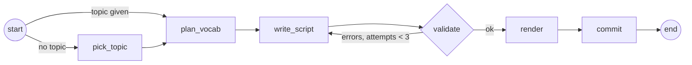

# VocalisCast — Design Doc

**Status:** Draft · **Author:** Dennis Jandow · **Date:** 2026-09-20

## 1. Summary

VocalisCast generates podcast episodes in the listener's **native language** about anything worth listening to: a story, a strange historical fact, a discussion. Woven into that episode is a small, fixed set of **target-language** items. Each one is explained briefly the first time it comes up and then used again and again in context for the rest of the episode.

The episode is not a vocabulary lesson with a theme. It is a real podcast, and the target-language items are seasoning. They do not have to relate to the topic or to each other (§4).

Script generation and voice generation run through provider adapters. Both work with a local model and with a hosted API; which one you get is decided entirely by environment variables (§5). The vocabulary store works the same way: an embedded file database or a database in a container, chosen by a URL (§8).

## 2. Goals / Non-goals

**Goals**

- Each episode has a fixed vocabulary of 5–10 items: words, phrases, idioms, or grammar basics such as pronouns and common verbs.
- **The topic and the vocabulary are independent.** An episode about a shipwreck can teach *however*, *to try*, *nevertheless*, and one nautical noun.
- New items are introduced once, explained briefly, then used ≥ N times in natural context.
- Items from earlier episodes come back as review, used less often and with no re-explanation.
- LLM and TTS are chosen by provider/model/URL/API-key environment variables. Local models work, but nothing in the code requires them.
- The database is chosen by a URL: embedded file or server.
- **No language-specific code or prompts.** Every language-dependent value is injected (§7).

**Non-goals (v1)**

- Web UI, mobile app, RSS feed. v1 is a CLI that writes an mp3.
- Quizzes or self-rating. Progress is measured by how many episodes featured an item (§8.3).
- Multiple learner profiles. One database per `VC_DB_URL`.
- Explicit grammar teaching. Items are taught by use, not by rule.

## 3. Why LangGraph

The pipeline is a straight line with one retry loop, so a plain script would work today. LangGraph is used anyway, because the things most likely to be added next are exactly the things it exists for:

- **Human in the loop.** `interrupt()` plus a checkpointer lets you approve or edit a script before the expensive TTS step. v1 already uses this: `vocaliscast script` stops before rendering, and `vocaliscast render` resumes the same thread (§6.3).
- **Tool calls.** Giving the writer node a web search or a Wikipedia lookup so that its facts are real is a node change, not a rewrite.
- **Resumability.** Rendering an episode takes minutes. With a checkpointer, a crash during render resumes from the saved script instead of regenerating it.
- **Branching.** Per-section script generation, a proofreading pass, or fan-out with `Send` to render lines in parallel all fit the same graph.

The cost is two dependencies (`langgraph`, `langchain`) and roughly 30 lines of graph wiring. `langchain.chat_models.init_chat_model` also solves the multi-provider requirement in §5.1 on its own, so a good part of that cost pays for itself.

## 4. What an episode is

This is the part that is easy to get wrong, so it is a design constraint, not a prompt detail.

**Wrong:** "Today's episode is about food" → the episode marches through *bread*, *cheese*, *apple*, *to eat*, *delicious*. That is a vocabulary list read aloud.

**Right:** "Today's episode is about the 1904 Olympic marathon, which was an absolute disaster" → the hosts tell the story, and the target-language items are *nevertheless*, *to give up*, *the doctor*, *what a mess* (idiom), and *they*. Four of the five have nothing to do with marathons.

Consequences for the design:

- The planner picks items from two pools: a few that the story happens to offer, and the rest from **high-frequency general vocabulary** — pronouns, common verbs, connectors, filler words, idioms. It is told explicitly that the items need not relate to each other.
- Non-topical items are *easier* to reuse 5+ times, not harder. Connectors, pronouns and common verbs fit into any sentence, which is exactly why they are worth teaching this way.
- The prompt puts the story first: the episode must stay interesting to someone who ignores the language part entirely.
- If no topic is given, a `pick_topic` node asks the model for an interesting story or fact. Running `vocaliscast new` with no argument is a supported, normal way to use the tool.

## 5. Model providers

### 5.1 LLM

```python
from langchain.chat_models import init_chat_model

llm = init_chat_model(
    model=os.environ["VC_LLM_MODEL"],            # "qwen3:14b", "gpt-5", "claude-opus-5", …
    model_provider=os.environ["VC_LLM_PROVIDER"], # "ollama", "openai", "anthropic", "google_genai", "groq", …
    base_url=os.getenv("VC_LLM_BASE_URL") or None,
    api_key=os.getenv("VC_LLM_API_KEY") or None,
    temperature=float(os.getenv("VC_LLM_TEMPERATURE", "0.8")),
)
structured = llm.with_structured_output(ScriptModel)  # Pydantic schema, see §9
```

That is the whole provider layer. `provider=openai` with a `base_url` also covers everything that speaks the OpenAI API: LM Studio, vLLM, llama.cpp server, OpenRouter, Together, Groq.

Sensible combinations:

| Setup | `VC_LLM_PROVIDER` | `VC_LLM_MODEL` | `VC_LLM_BASE_URL` |
|---|---|---|---|
| Local, docker compose | `ollama` | `qwen3:14b` | `http://localhost:11434` |
| Local, LM Studio | `openai` | whatever is loaded | `http://localhost:1234/v1` |
| Hosted | `anthropic` / `openai` | `claude-opus-5` / `gpt-5` | *(unset)* |

Structured output is not equally reliable everywhere. Small local models occasionally return malformed JSON. The write node therefore has `retry_policy=RetryPolicy(max_attempts=3)`, which covers parse failures and rate limits alike; content problems are handled separately by the validator (§6.2).

### 5.2 TTS

TTS providers differ in one way that matters here: **can you set the language per piece of text?**

| Provider | Per-span language | How VocalisCast uses it |
|---|---|---|
| `chatterbox` (local, MIT, 23 languages) | yes, `language_id` per call | Synthesize each segment separately and join. Native sentence in native pronunciation, target span in target pronunciation, same cloned voice throughout |
| `openai` (any `/v1/audio/speech` endpoint, incl. self-hosted Kokoro etc.) | no | Send the whole line as one request and let the model auto-detect. Simpler and faster, but the target span's pronunciation is out of your hands |
| `elevenlabs` (`eleven_multilingual_v2`) | no, but code-switching within a request is good | Same as above; currently the best-sounding option if you don't mind a hosted service |

All three sit behind one function:

```python
def speak(segments: list[Segment], voice: str) -> np.ndarray: ...
```

A provider that supports per-span language splits the segments; a provider that does not joins their text. Everything downstream — joining lines, silence, mp3 encoding — is shared.

For local voices, `VC_VOICE_A` / `VC_VOICE_B` are paths to ~10 s reference WAVs. For hosted providers they are voice IDs. Only clone voices you have the rights to.

### 5.3 docker-compose.yml

Ships in the repo. Ollama for the LLM, Postgres for the store, both optional through profiles.

```yaml
services:
  ollama:
    image: ollama/ollama:latest
    ports: ["11434:11434"]
    volumes: ["ollama:/root/.ollama"]
    restart: unless-stopped
    healthcheck:
      test: ["CMD", "ollama", "list"]
      interval: 10s
      timeout: 5s
      retries: 5

  db:
    profiles: ["db"]            # only starts with --profile db
    image: postgres:17-alpine
    environment:
      POSTGRES_USER: vocaliscast
      POSTGRES_PASSWORD: ${POSTGRES_PASSWORD:-vocaliscast}
      POSTGRES_DB: vocaliscast
    ports: ["5432:5432"]
    volumes: ["pgdata:/var/lib/postgresql/data"]
    healthcheck:
      test: ["CMD-SHELL", "pg_isready -U vocaliscast"]
      interval: 10s
      retries: 5

volumes:
  ollama:
  pgdata:
```

```sh
docker compose up -d                        # LLM only, embedded DB
docker compose exec ollama ollama pull qwen3:14b
docker compose --profile db up -d           # plus Postgres
```

On an Apple Silicon Mac, a container has no GPU access, so Ollama in Docker runs on the CPU and is slow. Use a native `ollama serve` there and keep the compose file for Linux hosts and for Postgres. TTS is not containerized: the local engine needs the GPU and runs in-process.

## 6. The graph



### 6.1 State

```python
class EpisodeState(TypedDict):
    topic: str
    plan: dict            # {"new": [...], "review": [...]}
    script: dict          # §9
    errors: list[str]     # no reducer: each validate run replaces the previous errors
    attempts: Annotated[int, operator.add]   # write_script returns {"attempts": 1}
    audio_path: str
```

### 6.2 Nodes

| Node | Does | Notes |
|---|---|---|
| `pick_topic` | Asks the LLM for an interesting story or fact | Only runs when no topic was given |
| `plan_vocab` | Reads due review candidates from the store, asks the LLM for `VC_NEW_WORDS` new items plus a review selection (§8.4) | Structured output |
| `write_script` | Writes the two-host dialogue as JSON, then runs `split_segments` over it | `RetryPolicy(max_attempts=3)` for transport and parse failures |
| `split_segments` (in `write_script`) | Cuts planned terms out of native-language segments into their own segments. Small models write the word inline and leave `vocab` empty, which is right content in the wrong shape | Deterministic, no round trip. Exact matches only |
| `validate` | Deterministic checks, fills `errors` | Pure function, unit tested |
| `render` | `speak()` per line, joins audio, writes `episode.mp3` and `transcript.md` | The expensive node |
| `commit` | Writes new items and bumps feature counts | Runs only after a successful render |

The validator rejects:

- a new item used fewer than `VC_NEW_MIN_USES` times, or missing its one `intro` segment
- a review item used zero times, or more than 3 times
- a target-language segment whose `vocab` is not in this episode's plan (so nothing untaught slips in)
- a script whose length is more than ±25 % off the target (§7)

```python
def after_validate(state) -> Literal["write_script", "render"]:
    if state["errors"] and state["attempts"] < MAX_ATTEMPTS:
        return "write_script"
    if state["errors"]:
        raise ScriptQualityError(state["errors"])   # the script is saved; --force renders it anyway
    return "render"
```

### 6.3 Wiring, checkpointer, human in the loop

```python
graph = (
    StateGraph(EpisodeState)
    .add_node("pick_topic", pick_topic)
    .add_node("plan_vocab", plan_vocab)
    .add_node("write_script", write_script, retry_policy=RetryPolicy(max_attempts=3))
    .add_node("validate", validate)
    .add_node("render", render)
    .add_node("commit", commit)
    .add_conditional_edges(START, lambda s: "plan_vocab" if s["topic"] else "pick_topic",
                           ["pick_topic", "plan_vocab"])
    .add_edge("pick_topic", "plan_vocab")
    .add_edge("plan_vocab", "write_script")
    .add_edge("write_script", "validate")
    .add_conditional_edges("validate", after_validate, ["write_script", "render"])
    .add_edge("render", "commit")
    .add_edge("commit", END)
    .compile(checkpointer=checkpointer, interrupt_before=["render"] if stop_before_render else None)
)
```

The checkpointer follows `VC_DB_URL`: `SqliteSaver` for a file URL, `PostgresSaver` for a server URL. The thread ID is the episode ID.

This gives the two-command workflow for free:

- `vocaliscast script "<topic>"` → `interrupt_before=["render"]`, so the graph stops with `script.json` written and nothing committed.
- `vocaliscast render <episode>` → `graph.invoke(None, {"configurable": {"thread_id": episode_id}})` resumes the same thread at `render`.

Editing `script.json` by hand between the two commands is the poor man's human-in-the-loop. A real `interrupt()` that asks for approval inside the graph is a later change to one node, and the plumbing for it is already here.

## 7. Language independence

There is no per-language code path and no per-language prompt. Every prompt is one template with injected values.

| Language-dependent thing | How it is handled |
|---|---|
| Language names in prompts | ISO 639-1 codes from env, resolved to names through one lookup table (`babel` or a small dict). Prompts say "{native_language}", never "English" |
| Examples inside prompts | Placeholders only (`"<a word in {target_language}>"`). A real example in one language would bias item choice and phrasing toward that language |
| Dictionary form | "Give each item in the citation form a learner's dictionary would use for {target_language}" — no talk of articles, infinitives or cases, which are not universal |
| Counting uses of an item | The `vocab` key on each segment, never string matching. Works with inflection, agglutination, and scripts without spaces |
| Case-insensitive uniqueness | A `term_key` column holding Python's `str.casefold()` of the term. SQLite's `NOCASE` is ASCII-only and would treat *Straße* and *STRASSE* as different, or break for Turkish *i* |
| Episode length | Measured in **characters**, not words: `VC_CHARS_PER_MINUTE` (default 900, suitable for Latin scripts; use ~250 for Chinese or Japanese). Word counting assumes spaces, which many languages do not use |
| Which languages the voice supports | Checked at startup against the provider's language list. Fail fast with a clear message rather than producing a mispronounced episode |
| Text direction and encoding | UTF-8 everywhere, no case changes for display, no assumptions about direction in `transcript.md` |

Swapping `VC_TARGET_LANG=de` for `ja` should need nothing but a model that speaks Japanese, a TTS provider that supports it, and a `VC_CHARS_PER_MINUTE` that fits.

## 8. Vocabulary store

### 8.1 Embedded or server, by URL

Yes, Python ships an embedded database: `sqlite3` is in the standard library, so the default setup needs nothing installed and no container.

Both backends are reached through **SQLAlchemy Core** (no ORM). One schema definition, one set of queries, and the URL scheme picks the backend:

| `VC_DB_URL` | Backend |
|---|---|
| *(unset)* → `sqlite:///$VC_DATA_DIR/vocab.db` | Embedded file, the default |
| `sqlite:///./vocab.db` | Embedded file elsewhere |
| `postgresql+psycopg://vocaliscast:…@localhost:5432/vocaliscast` | The compose container, or any Postgres |

Writing the SQL twice by hand would be more code than the dependency, and SQLAlchemy already handles the dialect differences (upserts, types, connection pooling).

### 8.2 Schema

```sql
CREATE TABLE episodes (
  id          INTEGER PRIMARY KEY,
  native_lang TEXT NOT NULL,
  target_lang TEXT NOT NULL,
  topic       TEXT NOT NULL,
  dir         TEXT NOT NULL,      -- folder holding script.json / mp3
  rendered_at TIMESTAMP           -- NULL until the audio succeeded
);

CREATE TABLE words (
  id             INTEGER PRIMARY KEY,
  native_lang    TEXT NOT NULL,
  target_lang    TEXT NOT NULL,
  term           TEXT NOT NULL,   -- citation form as shown to the learner
  term_key       TEXT NOT NULL,   -- term.casefold(), for uniqueness
  translation    TEXT NOT NULL,
  kind           TEXT NOT NULL,   -- word | phrase | idiom | basic
  times_featured INTEGER NOT NULL DEFAULT 0,
  last_episode   INTEGER REFERENCES episodes(id),
  UNIQUE (native_lang, target_lang, term_key)
);
```

Every row is scoped to a language pair, so changing `VC_TARGET_LANG` gives a separate vocabulary in the same database.

### 8.3 Status is derived, not stored

| Status | Rule |
|---|---|
| new | not in the table |
| learning | `times_featured < VC_LEARNED_AFTER` (default 3) |
| learned | `times_featured >= VC_LEARNED_AFTER` |

### 8.4 Picking items

1. **Review candidates** (max 15): *learning* items, oldest `last_episode` first, plus *learned* items not featured in the last 10 episodes, so learned material resurfaces occasionally.
2. The **oldest learning candidate is always included**, which stops an item from being passed over forever. The LLM picks the remaining `VC_REVIEW_WORDS - 1`, preferring ones it can place naturally — which, per §4, is not the same as "ones that match the topic".
3. For new items the planner is asked for a mix: at most about half tied to the story, the rest high-frequency general vocabulary at level `VC_LEVEL`. Items already in the store are dropped afterwards (the unique index decides), and if fewer than 5 survive, the node re-prompts once with a "not these" list. Sending the entire known-word list in every prompt would grow without bound; filtering afterwards does not.

### 8.5 Usage frequency (enforced by the validator)

| Item type | Explanation | Uses per episode |
|---|---|---|
| new | exactly one `intro` segment, 1–2 sentences in the native language | ≥ `VC_NEW_MIN_USES` (default 5) |
| review | none; a half-sentence reminder on first use is allowed | 1–3 |

## 9. Script format

The LLM returns this structure, enforced by a Pydantic schema through `with_structured_output`. Each target-language span is its own segment and names the planned item it belongs to.

```json
{
  "title": "The Worst Marathon Ever Run",
  "lines": [
    {"speaker": "A", "segments": [
      {"text": "Only fourteen of the thirty-two runners finished. "},
      {"text": "<target-language item>", "vocab": "<planned item>", "intro": true},
      {"text": " — that means 'nevertheless', and you'll hear it a lot today."}
    ]},
    {"speaker": "B", "segments": [
      {"text": "And "},
      {"text": "<target-language item>", "vocab": "<planned item>"},
      {"text": ", one of them was riding in a car for a while?"}
    ]}
  ]
}
```

- A segment with no `vocab` is native language.
- `intro: true` marks the single place a new item is explained.
- `transcript.md` is rendered from this JSON with target spans in bold, and saved next to the mp3.

## 10. Configuration

Everything comes from the environment and is validated at startup: unknown language codes, a voice the provider does not have, a missing API key, and an unreachable database all fail immediately with a clear message.

| Variable | Default | Meaning |
|---|---|---|
| `VC_NATIVE_LANG` | `en` | ISO 639-1 code of the podcast language |
| `VC_TARGET_LANG` | `de` | ISO 639-1 code of the language being learned |
| `VC_LEVEL` | `A2` | CEFR-ish hint for item difficulty |
| `VC_LLM_PROVIDER` | `ollama` | `ollama`, `openai`, `anthropic`, `google_genai`, `groq`, … |
| `VC_LLM_MODEL` | `qwen3:14b` | Model name at that provider |
| `VC_LLM_BASE_URL` | *(unset)* | For self-hosted or OpenAI-compatible endpoints |
| `VC_LLM_API_KEY` | *(unset)* | Hosted providers |
| `VC_LLM_TEMPERATURE` | `0.8` | |
| `VC_LLM_OPTIONS` | *(unset)* | JSON merged into the provider's arguments, e.g. `{"num_ctx": 32768}` |
| `VC_TTS_PROVIDER` | `chatterbox` | `chatterbox`, `openai`, `elevenlabs` |
| `VC_TTS_MODEL` | *(provider default)* | Checkpoint path or hosted model name |
| `VC_TTS_BASE_URL` | *(unset)* | For self-hosted speech endpoints |
| `VC_TTS_API_KEY` | *(unset)* | Hosted providers |
| `VC_TTS_DEVICE` | `auto` | `mps` / `cuda` / `cpu`, local engines only |
| `VC_VOICE_A`, `VC_VOICE_B` | *(required)* | Reference WAV path (local) or voice ID (hosted) |
| `VC_DB_URL` | `sqlite:///$VC_DATA_DIR/vocab.db` | Embedded file or server |
| `VC_DATA_DIR` | `~/.vocaliscast` | Episodes, and the default database file |
| `VC_NEW_WORDS` | `7` | New items per episode, clamped to 5–10 |
| `VC_REVIEW_WORDS` | `3` | Review items per episode |
| `VC_NEW_MIN_USES` | `5` | Minimum uses of each new item |
| `VC_LEARNED_AFTER` | `3` | Episodes featuring an item before it counts as learned |
| `VC_EPISODE_MINUTES` | `10` | Target length |
| `VC_CHARS_PER_MINUTE` | `900` | Characters per minute of speech, for the length target |

## 11. CLI

```sh
vocaliscast new "the 1904 Olympic marathon"   # plan → write → validate → render → commit
vocaliscast new                               # the model picks the story
vocaliscast script "<topic>"                  # stops before render (interrupt)
vocaliscast render <episode-id|dir>           # resumes that thread, then commits
vocaliscast words                             # term, translation, kind, status, times featured
```

```
~/.vocaliscast/episodes/0007-1904-olympic-marathon/
├── script.json
├── transcript.md
└── episode.mp3
```

## 12. Code layout

```
vocaliscast/
├── docker-compose.yml
├── pyproject.toml            # langgraph, langchain, sqlalchemy, numpy; extras: [chatterbox], [postgres]
├── vocaliscast/
│   ├── cli.py                # argparse, three commands
│   ├── config.py             # env → a frozen dataclass, validated at startup
│   ├── db.py                 # SQLAlchemy Core: schema, due-items query, commit
│   ├── graph.py              # StateGraph: nodes, validator, wiring
│   ├── prompts.py            # language-neutral templates
│   └── tts.py                # speak() + the three providers
└── tests/test_pipeline.py
```

Heavy imports (`torch`, `chatterbox`) live in `tts.py` and load lazily, so `script` and `words` stay fast.

## 13. Prompt sketch (language-neutral)

**Plan node:**

> You plan the vocabulary for a podcast episode in {native_language} that teaches {target_language} at roughly level {level}. The episode is about: "{topic}".
>
> Propose {n_new} items to teach. **They do not need to relate to the topic or to each other.** At most {n_topical} may come from the topic; the rest should be high-frequency general vocabulary — pronouns, common verbs, connectors, everyday idioms — that a learner needs in any conversation. Give each item in the citation form a learner's dictionary for {target_language} would use, with its {native_language} translation and a kind (word / phrase / idiom / basic).
>
> From REVIEW CANDIDATES, choose {n_review} that you can place naturally in this episode. Do not propose anything in the ALREADY KNOWN list.

**Write node:**

> Write a natural, entertaining podcast dialogue in {native_language} between hosts A and B about "{topic}", about {chars} characters long. The episode must be worth listening to on its own; someone who ignores the language teaching should still enjoy it.
>
> Every {target_language} expression MUST be its own segment carrying a "vocab" key from the list below. Use no other {target_language} anywhere.
>
> - NEW items: explain each one briefly where it first appears (`intro: true`), then use it at least {min_uses} times, in place of the {native_language} expression, wherever it fits.
> - REVIEW items: use each 1–3 times with no full explanation.
>
> Some items have nothing to do with the topic. That is intentional: work them into the conversation anyway, as ordinary speech, not as a vocabulary digression.

Retry: the previous JSON followed by "Fix these problems:" and the validator's error list.

## 14. Testing

`tests/test_pipeline.py`, plain asserts, no LLM or TTS needed:

- validator: too few uses, missing intro, an unplanned target-language segment, length out of range
- selection: the oldest learning item is always a candidate; recently featured learned items are excluded; language pairs stay separate
- `term_key` uniqueness with non-ASCII case (*Straße* / *STRASSE*)
- graph routing: `after_validate` retries while attempts remain, raises afterwards
- the store runs against SQLite in memory; Postgres is checked by running the same test module with `VC_DB_URL` pointed at the compose container

The LLM and TTS are judged by listening. Mocking them would only test the mocks.

## 15. Risks

| Risk | Impact | Mitigation |
|---|---|---|
| Very short TTS inputs (a single word) glitch in the local engine | The taught item sounds bad, which defeats the purpose | **Spike this first (M0).** If it glitches: synthesize the word inside a carrier phrase and trim it, or use a provider that handles the whole line |
| Hosted TTS auto-detects the language of a short foreign span wrongly | Native accent on the target item | Prefer `chatterbox` for exact control; keep hosted providers as the convenient option |
| A small local model ignores the usage counts or the "topic first" rule | Vocabulary-list episodes | **Measured:** a 9B model reached 3 of 5 items and sometimes ignored the vocabulary entirely on a late attempt. Validator plus retry catches it; 14B and up is the recommendation. If it persists: outline first, then section by section with a per-section quota |
| Thinking models fill a small context window with reasoning and return nothing | Empty structured output, unusable | **Measured on Ollama:** defaults raised to `num_ctx=16384` and `reasoning=False`; other providers via `VC_LLM_OPTIONS` |
| Too much vocabulary for the episode length | The writer cannot win, three attempts wasted | Config refuses it at startup: roughly 60 characters of speech are needed per required use |
| Structured output differs between providers | Parse failures on some backends | `with_structured_output` plus a node retry; a provider that cannot do it is not supported |
| Non-topical items forced in clumsily | Awkward episodes | This is a prompt-quality problem — listen to M1 output before building further |
| LangGraph and LangChain version churn | Breakage on upgrade | Pin both in `pyproject.toml`; the graph uses only the stable core API |

## 16. Milestones

- **M0 — TTS spike (½ day):** render one mixed-language line with two voices through `chatterbox`, and the same line through a hosted provider. Compare, and measure speed.
- **M1 — Script:** config, store, `plan_vocab`, `write_script`, `validate`, the graph, and the `script` command. Iterate on prompts until non-topical items land naturally.
- **M2 — Render:** `tts.py`, the `render` and `new` commands, checkpointer resume, `commit`.
- **M3 — Polish:** `words`, `transcript.md`, tests, Postgres run-through.

## 17. Open questions

1. **Item mix:** should the topical/general split be a setting (`VC_TOPICAL_MAX`), or is "at most half, model's judgement" enough?
2. **Level progression:** should `VC_LEVEL` rise on its own once enough items are learned, or stay manual?
3. **Series:** should episodes be able to form an arc (a story continued over several episodes), or does each one stand alone?
4. **Review depth:** learned items currently return after 10 episodes, once. Is a proper interval (10, 30, 90 episodes) worth the extra column?
